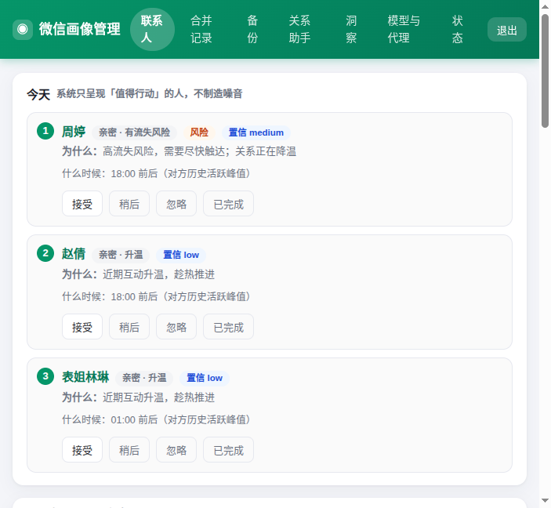
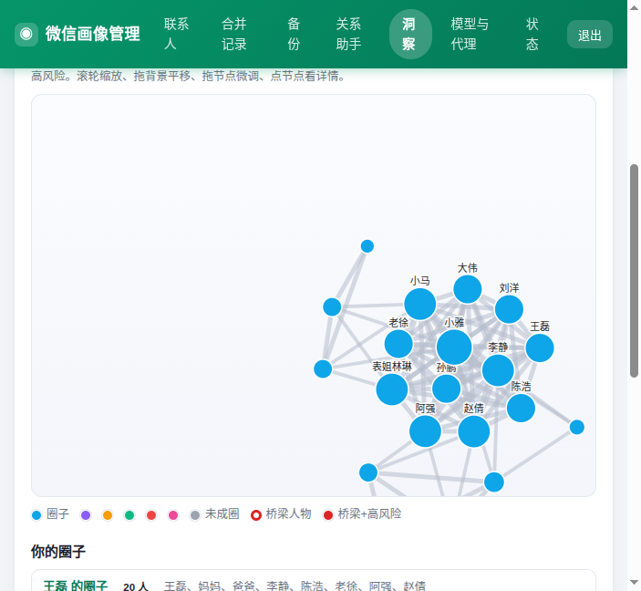
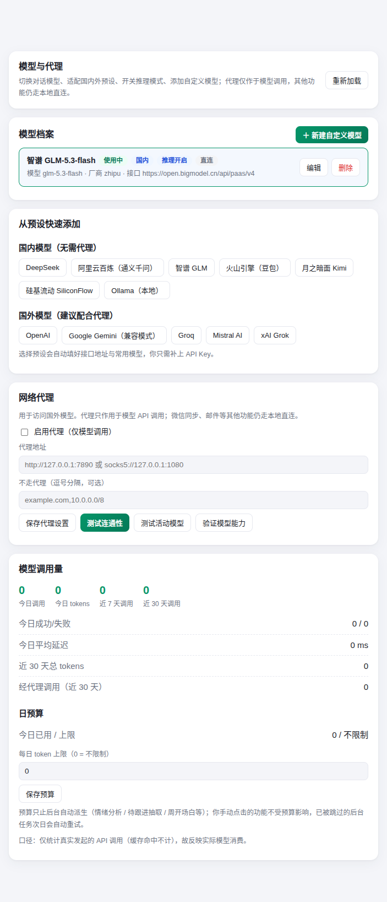

# wechat-profile-bot

   

**把微信聊天记录变成一台「关系操作系统」。** 粘贴记录 → 自动入库去重 → 抽取**可溯源**的可信事实（事实/推断分层、冲突进人工复核）→ **确定性评分**给出「今天最该联系的人」与依据 → 行动后自动回测回暖率。纯本地 SQLite、单二进制部署；**不读微信数据库、不监控、不自动发消息**，LLM 全失效时核心功能照常工作。

配套 Windows 桌面端：[github.com/caodabao99/wechat-profile](https://github.com/caodabao99/wechat-profile)（v4.0.0）

## 界面速览

| 首页 · 今天值得做（由 `decision/today` + `memory/review` + `risks` + `portfolio` 四端点拼装） | 洞察 · 社交网络：自研 SVG 力导向图（圈簇 / 桥梁人物 / 脆弱度） |
|---|---|
|  |  |

| 模型与代理：多档案 / 代理 / 用量 / 自定义请求参数（`extraBody`）/ 一键验证模型能力 | |
|---|---|
|  | |

> 截图为合成演示数据。本项目的 AI 质量不靠嘴说：内置 7 条能力探针（情绪过度报警陷阱 / 跟进过度抽取 / 幻觉 / 缺失信息拒答 / 冲突 / 时间推理），**在网页端点一下就能给当前模型出成绩单**。

## 30 秒跑起来

```bash
# 方式 A：下载 Release 二进制（win/linux），或
# 方式 B：Docker —— 下载镜像 tar 后
docker load -i wechat-profile-bot-docker-v7.4.0.tar.gz
docker compose up -d      # 打开 http://服务器IP:17965 完成 Token+2FA 登录
```

详细步骤见 [快速开始](#快速开始) 与 [Docker 部署](#docker-部署)。

<details>
<summary><b>完整功能清单（40+ 项，点击展开）</b></summary>

## 功能

- **微信消息收发**：通过腾讯官方 iLink Bot API 长轮询收发消息，无需公网 IP/Webhook/内网穿透
- **聊天记录识别**：直接粘贴微信多选复制的聊天记录，自动解析并存入 SQLite
- **人物画像**：AI 自动生成/更新联系人画像（性格、兴趣、沟通风格、关系等）
- **意图分析**：分析对方最新消息的潜在意图、情绪、建议回复
- **联系人管理**：备注、合并（换昵称后关联）、撤销合并、删除
- **REST API**：内置 HTTP 接口（默认端口 17965），Windows 桌面版可远程复用同一份数据与模型分析
- **关系助手**（网页端，默认关闭）：重要日子提醒、久未联系提醒、亲密度评分、AI 情绪预警，每日提醒 / 每周报告通过 SMTP 邮件发送
- **每周维护计划**（网页看板）：每周一自动排行“本周最该联系的 5 个人”并草拟开场白，只在看板展示不发邮件，可手动立即重算
- **隐式反馈闭环**：粘贴记录入库时自动识别你已联系→标建议已执行，14 天后自动回测互动是否回暖，看板展示近 90 天采纳率/回暖率，全程零手动操作
- **关系图谱**（洞察页）：从画像交叉比对共同城市/同类职业/共同兴趣/提到彼此，纯 SQL 推导谁和谁可能认识及可信度
- **人生总览**（洞察页，人生模拟器）：把每段关系算成一份“人际资产账本”——余额（关系深度）、现金流（近期互动相对历史的增值/缩水）、折旧（断联天数 + 冷却斜率）、风险分与象限分类，并汇总人际总财富、依赖集中度、高风险将断清单与时间精力回流偏差。纯 SQL 零模型开销，每周一自动算好，打开即看
- **未来推演**（洞察页，人生模拟器）：按当前互动趋势把每段关系确定性地快进到 90 天后，算出“什么都不做会断掉几段”；系统自动生成三条 what-if 对比（维持现状 / 每周联系高风险清单一分钟 / 把时间往家人身上移），每条附“可多保住几段 / 总财富变化”，人只看结果不拨旋钮
- **人生年表**（洞察页，人生模拟器）：从最早对话、按年活跃度、跨年最长情的关系、最近在意的人与你手动记下的大事，自动聚合出里程碑年表；数据稀疏时优雅降级为空，不强推不乱预测
- **社交网络智能**（洞察页，高阶洞察）：把两两关联升级成一张网络，跑纯确定性图算法（连通分量 + 标签传播圈簇、Tarjan 割点、Brandes 介数中心性）——自动识别你的各个圈子、找出“删掉就会让网络碎片化”的关键桥梁人物、给出网络脆弱度评分与跨圈撮合引荐（“你可以把 X 介绍给 Y”），每条附可解释依据，零模型开销
- **自我关系画像**（洞察页，高阶洞察）：从全体关系里反照出你自己——谁总在先开口（全局 + 按类别）、精力正从哪个类别迁向哪个类别、有多少关系几乎只有你一厢情愿、以及你的整体社交风格标签（主动/被动、深耕/广撒网、偏向哪类人），工具从“看别人”变成“照见自己”，零新增采数
- **证据化干预学习**（洞察页，高阶洞察）：用你自己的历史回测数据学“对哪类人做什么真有效”——按干预方式分组算回暖率并给出 Wilson 95% 置信区间，样本不足时诚实降级只报基线率、绝不假装精确；按置信下界 × 覆盖人数排出“被验证有效的动作”
- **本周简报**（洞察页，高阶洞察，进入洞察页默认落地）：把人生模拟器 + 社交网络 + 自我画像 + 干预学习四层揉成一页“打开即行动”的每周摘要——Top-3 本周最该做的事（每条指向具体人、附来源层与依据）、全局健康度一行、最强信号；纯确定性模板文案，每周一自动随四层刷新
- **洞察趋势与周环比**（v4.5.0）：每周把四层的关键标量追加成一条 append-only 历史快照（只留近 52 周），各子页头部指标旁渲染 sparkline 走势，简报顶部新增“本周关键变化”块（如“高风险关系 3→5”“你先开口率 71%→64%”）——把产品从“看当下”升级为“看走势”，纯确定性、零新增采数
- **跨层闭环自校准**（v4.5.0）：复用已有干预回测表（零新表），让“上次建议是否奏效”反向重排简报 Top 行动——已回暖的关系自动沉底不重复催、仍无改善的浮顶并附“上次建议后仍无改善”标注，四层互相咬合；无回测数据时严格等同旧行为
- **图计算规模护栏**（v4.5.0）：联系人增长后，网络图算法进 Brandes/Tarjan 前对节点数封顶（按亲密度取最亲密的 250 人核心圈，tie-break 按 id 保确定性），防周一重算拖慢单连接池，并在洞察里诚实说明“已聚焦核心圈”
- **数据可携与遗忘**（v4.5.0）：新增一键全量开放 JSON 导出（可选脱敏：姓名→伪名、正文抹除、保留结构与计数），并把“彻底删除联系人”的级联补齐隐私残留（互动指标/画像事实与证据/关系连线/建议回测）——纯本地、只读、零费用，给你的敏感关系数据真正的掌控感
- **关系知识图谱可视化**（v4.6.0，洞察页社交网络）：把已有图算法算出的完整拓扑（节点/连线及权重、圈簇归属、割点、介数重要度）导出到前端，用自研内联 SVG 力导向图交互呈现——节点=联系人、连线粗细=互动强度、颜色=所属圈子、红环=桥梁人物、红填充=桥梁且高风险，支持缩放/平移/拖拽微调/悬停详情/点击跳转联系人，把数据洞察升级为视觉洞察。零第三方库（不引 D3/Cytoscape）、确定性布局（不用随机数）、不新增端点
- **关系维护日历**（v4.7.0，关系助手页）：新增只读聚合端点 `GET /api/assistant/calendar/events`，把生日/纪念日（年度重复逐年展开、含 2/29 平年回退 2/28）、手动大事记、带截止日的待跟进聚合成统一事件流，前端用自研 7 列月历网格呈现（按 kind 着色、点事件直达联系人）。待跟进新增可选 `due_date` 列（懒建表走幂等 ALTER、不 bump user_version、不改 backup.go）。零第三方库（不引 FullCalendar）、确定性排序、只读端点
- **对话质量评分**（v4.8.0，联系人驾驶舱）：新增只读端点 `GET /api/contacts/{id}/quality?days=90`，对单个联系人从**回复及时性 / 对话深度 / 话题多样性 / 情绪正向度**四维各给 0-100 分并加权出综合分，前端用手写内联 SVG 雷达图 + 维度条呈现。全部在本地按消息与画像确定性计算、不调模型（情绪为增值表，缺失则该维不计入综合、按比例归一，诚实标注“无数据”）；可随时刷新、结果稳定可复现。零第三方库（不引 Chart.js/ECharts）、只读、不新增表
- **智能回顾摘要**（v4.9.0，联系人驾驶舱）：新增 `POST /api/contacts/{id}/summary` body `{days}`，选定时间窗口后基于窗口内真实聊天原文调模型产一份结构化回顾——overview一段话总结 + topics 话题 chips + todos 待办列表（每条标 [n] 出处可跳转原文、可一键转跟进）。复用 ask.go 两段式检索与降级：未配模型 503、不编造；窗口内原文不足 4 条时如实返回空摘要 + note；模型返回坏 JSON 回退为原文摘录。摘要一次性返回不落库。
- **插件化分析引擎·提示词模板外置**（v5.1.0，关系助手）：把全部 13 个 LLM 提示词模板从硬编码外置为可编辑「分析插件」——内置默认经 `go:embed` 逐字内嵌、可被 SQLite `prompt_templates` 覆盖并**运行时热加载**（改完即生效、无需重启）。变量用**字面占位符 `{{key}}`**、渲染为单趟精确字符串替换（非 text/template，杜绝模板注入、结果确定）；保存时强制校验必填变量齐备、拒绝未知/游离占位符、限 8KB；坏覆盖或读取失败一律**回退内置默认、绝不因模板问题 500 阻断业务**。默认渲染与迁移前 `fmt.Sprintf` **逐字节一致**（golden 测试锁死，纯重构零行为变化）。新增 `/api/assistant/prompts*` 一组端点支持列表/取详情/保存/重置/试渲染，覆盖表自动纳入备份恢复。
- **分析插件（提示词）网页管理界面**（v5.2.0，关系助手页）：把上述提示词端点做成可视化面板「🧩 分析插件（提示词）」——列出 15 个模板（标题/所属功能/是否已自定义徽标/更新时间），行内展开即可编辑当前生效正文、点变量 chips 在光标处插入 `{{key}}`、实时字节计数（8KB 上限提示）、与内置默认对照、一键预览（用样本变量字面渲染、不调模型）、保存自定义 / 恢复默认。纯前端复用既有 Vue + `api()` 范式，**零第三方依赖**、无新增后端端点。
- **对话质量历史趋势**（v5.2.1，联系人驾驶舱）：在既有四维雷达图旁新增一条「综合分历史趋势」折线——每次查看质量评分时按 ISO 周幂等留存综合分快照到新派生表 `contact_quality_history`（每联系人仅留近约 104 周），前端复用既有零依赖 `sparkPoints` 内联 SVG 折线呈现、附最新值与较上期环比。全程本地确定性计算、不调模型、惰性采集不新增后台任务；best-effort 写历史失败不影响评分响应。零第三方库，`GET /api/contacts/{id}/quality` 响应新增 `history` 字段。
- **关系成就 / 里程碑系统**（v5.2.1，联系人驾驶舱）：新增只读端点 `GET /api/contacts/{id}/achievements`，从聊天记录**确定性自动派生**关系里程碑——累计消息（100/500/1000/5000 条）、连续互动天数（7/30/100 天，messages ∪ archive 活跃自然日最长连续段）、相识周年（1/3/5 年，起点=首条消息时间）。前端用成就卡片网格呈现（达成亮徽章+解锁日期、未达成进度条）。首次跨越某档位即写 `contact_achievements` 去重表 + 一条 `kind="milestone"` 的 `contact_events`，于是「时间线」标签自动留下解锁历史；重复检测幂等、不重复写。全程本地计算、不调模型、可离线单测；去重表按持久化用户数据纳入备份恢复。零第三方库。
- **关系健康度综合仪表盘**（v5.3.0，洞察页）：新增只读端点 `GET /api/relationships/health?window=90`，为每位联系人融合亲密度基座 + 趋势（升温/持平/降温/沉睡）+ 情绪均值 + 沉默衰减 + 单向惩罚，算出一个 0-100 的**关系活力分**（与驾驶舱「对话质量分」不同口径），按优秀/良好/一般/需关注/危险五档分布。前端洞察页新子标签展示汇总均值 + band 直方条 + 全局热力图网格（绿→红着色、点格直达联系人）+ 最需关注榜。全程纯本地确定性、计算即读不落库、不调模型；`fuseHealth` 为可脱库单测纯函数，联系人上限护栏 300。零第三方库。
- **智能关系圈层管理**（v5.3.0，洞察页）：新增只读端点 `GET /api/relationships/circles`，按互动频率（近90天活跃天数）+ 亲密度确定性分入**核心/亲密/社交/弱联系**四层（阈值 75/40/15），每层配一套差异化维护打法与建议节奏（周/两周一月/季），并可选贴上社交网络圈簇归属标签。前端洞察页新子标签四层堆叠分区 + 成员 chips（点直达）。不重复 v5.0.0 打标签——圈层是「分层视图 + 每层打法」的独立视角；纯本地、计算即读、不调模型；`assignTier` 为可脱库单测纯函数。零第三方库。
- **主动关系教练**（v5.3.0，关系助手页）：新增只读端点 `GET /api/assistant/coach` 与 `GET /api/contacts/{id}/timing`。教练卡片只读装配既有周计划的 Top 目标，每条附「为何联系（理由）+ 说什么（复用已有 draft 话术、可复制）+ 什么时候发（时机建议）」；时机为**净新增维度**——从对方历史发言的 `messages(∪archive)` 时间戳聚成小时×周几直方，算出最佳时段/星期，样本不足 8 条时诚实返回「数据不足、建议常规时段」。零新模型调用（draft 有则用、无则留空 + note）；`hourWeekdayHist` 为可脱库单测纯函数。前端助手页新面板。零第三方库。
- **关系维护挑战 / 游戏化**（v5.3.0，关系助手页）：新增只读端点 `GET /api/assistant/challenges`，每周从「久未联系 / 待回复 / 核心圈」确定性挑最多 3 条小目标（按 ISO 周幂等入库、跨周不重复刷），你照常发消息、系统按本周新增互动自动判定达成并累加 XP（等级 = 1 + ⌊xp/100⌋），首次达成写一条 `kind="milestone"` 事件与 v5.2.1 成就徽章联动。两张新持久表 `weekly_challenges`/`gamification_state`（懒建表、不 bump user_version）作为用户数据自动纳入备份恢复。前端助手页新面板（周挑战清单 + 本周进度条 + XP 经验条 + 等级）。纯本地确定性、不调模型。零第三方库。
- **消息主题演化追踪**（v5.3.0，洞察页）：新增 `GET /api/contacts/{id}/topics`（只读历史）与 `POST /api/contacts/{id}/topics/analyze`（手动触发），并挂入助手周一调度自动刷新。对活跃联系人按周让模型聚类聊天主题，产 `{topics:[{name,weight,status:emergent/persistent/fading}]}` 写入持久表 `contact_topic_history`（每联系人裁剪近 104 周）；前端洞察页新子标签展示联系人×主题演化表（chips 带 ↑涌现/→持续/↓消退）。为唯一新增 LLM 功能，仅当已配模型且开启高阶洞察时才跑（否则返回空 + note、不 500、绝不编造）；坏 JSON 回退上周快照；本周周锁防并发/重跑。新增第 14 个提示词模板 `topic_evolution`（13→14）。
- **关系断点预警**（v5.4.0，洞察页健康仪表盘）：复用 `ComputeHealth` 已算好的近30天/前30天互动量与沉默天数，`projectCooling`（可脱库单测纯函数）由衰减斜率前瞻预测「预计多少天进入沉寂」，分级 `none/watching/urgent`。`GET /api/relationships/health` 响应**向后兼容**新增 `items[].alert`/`etaDays` + `summary.alertCount` + `alerts`（仅正在降温的关系子集，按紧急度排序）；前端新子视图抢在断联前提醒你主动联系。零新端点、零模型、不落库。
- **消息密度热力图**（v5.4.0，联系人驾驶舱）：新增只读端点 `GET /api/contacts/{id}/heatmap?year=YYYY`，按自然日聚合 `relationship_daily_metrics` 的 `me_count+other_count`（该联系人指标为空但有消息时沿用自愈重建），返回 `{year,days,max,total}`；前端以 GitHub 贡献图式 53×7 SVG 网格按日着色、hover 显日期+条数，一眼看穿关系的季节变化。纯 SQL、计算即读、不新增表。
- **互动节奏分析**（v5.4.0，联系人驾驶舱）：新增只读端点 `GET /api/contacts/{id}/rhythm`，`latencyStats`（回复间隔中位数+秒回率）与 `timeSignature`（深夜聊友/早安伙伴/日间型）为可脱库单测纯函数，复用 `computeContactTiming` 的小时/周一直方口径，返回 `{replyMedianMin,fastRatio,signature,bestHours,bestWeekdays,sample,note}`。前端「互动节奏」卡呈现节奏画像 + 时段签名。纯本地统计、零模型。
- **标签冲突检测**（v5.4.0，标签管理）：新增只读端点 `GET /api/assistant/tags/conflicts`，`detectTagConflicts`（可脱库单测纯函数）按内置互斥标签组（亲密×疏远、家人×职场）检测同一联系人身上的矛盾标签，返回冲突清单（空则 note「标签体系自洽」）；前端标签管理弹层新增冲突面板、一键跳联系人消歧。一趟锁读已挂标签、只读不写库、零模型。
- **对话风格镜像**（v5.4.0，联系人驾驶舱）：新增只读端点 `GET /api/contacts/{id}/mirror`，`lexicalRichness`/`avgLen`/`markerShare`/`emojiShare` 等纯函数按 rune 统计你发给某联系人的消息，并与你的全局均值对比，产「你在 TA 面前的样子」标签（话痨型/简洁型/表情党/问询型/热情型…）；前端「风格镜像」卡以维度条 + delta 徽标呈现。零第三方依赖、纯本地文本统计、不新增表。
- **关系能量流桑基图**（v5.4.0，洞察页新子标签「能量流」）：纯前端手绘 SVG 桑基——「我」→ 四层圈带 → 每层 Top-N 联系人，连线宽度∝亲密度 score、节点按圈层/score 确定性排序（无随机数），数据源直接复用 `GET /api/relationships/circles`。零后端改动、零第三方库、点叶子直达联系人。
- **数据健康自检报告**（v5.4.0，状态页）：新增只读端点 `GET /api/system/data-report`，一趟锁纯 SQL 聚合 DB 体积 / 消息总数与近30天增速 / 联系人·画像·标签·时间线计数与覆盖率 / 各派生缓存表行数与存在性 / 最近成功备份，前端「数据健康自检」面板以指标卡 + 覆盖率条呈现。纯本地只读、不新增表、不调模型。
- **关系叙事生成**（v5.5.0，联系人驾驶舱）：新增 `POST /api/contacts/{id}/narrative`（`body {days}`），复用 summary 管道（`computeAchMetrics`/`loadSummaryInputs`/`numberMessagesForSummary`/`latestTopicsBefore`/`RenderPrompt`）把相识年数、首次互动、近期主题、往来条数 + 编号原文喂给模型，写一段温暖的关系故事；**双重降级**：无 LLM / 调用失败 / 产物空或短于阈值时回落为 `buildDeterministicNarrative` 纯事实拼成的确定性叙事，**永不 503、不编造**（`source` 标记 `llm`/`deterministic`）。新增第 15 个提示词模板 `relationship_narrative`（提示词注册表 14→15，同步更新 `prompts_test.go`/`prompts_api_test.go`/`feature_sweep_test.go` 与本文档）。不落库、计算即返回。前端「关系故事」卡展示叙事 + 来源徽标 + 近期主题 chips，并可一键 canvas 手绘导出为精美分享图（纯前端、零第三方库）。
- **关系目标追踪**（v5.5.0，关系助手页 + 联系人详情）：新增持久表 `relationship_goals`（懒 `ensureGoals`、不 bump user_version、不入 `derivedTables`、依动态 `listRestoreTables` 自动纳入备份/恢复）与 CRUD 端点 `GET/POST /api/assistant/goals`、`POST /api/assistant/goals/{id}/complete`、`DELETE /api/assistant/goals/{id}`。用户为某联系人自设可量化目标（如「本周主动发 5 条」），系统按窗口读 `relationship_daily_metrics` 的 `me_count` 自动判定达标：达成即置 `done`、`+XP`、升级（与 v5.3.0 挑战共用 `gamification_state`/`levelForXP`）并写一条 `kind="milestone"` 事件。与「维护挑战」语义划清（挑战=系统建议、目标=用户自设）；达标判定/手动完成均幂等（仅处理 `active` 行）。`goalProgressPct`/`goalDateWindow`/`normalizeGoalMetric` 为可脱库单测纯函数。单连接池三趟锁（读候选/写库/锁外补事件）绝不嵌套。前端助手页「关系目标」面板（进度条 + 完成勾选 + 新建表单）与联系人详情「TA 的目标」子列表。
- **智能联系人自动分组**（v5.0.0，标签管理）：新增只读端点 `GET /api/assistant/tags/suggest?ids=1,2,3`，基于联系人画像（地域/职业/兴趣）与互动指标（亲密度分层、情绪告警、往来待跟进）用**确定性规则**批量产标签建议（含命中理由与置信度），前端一键/勾选批量采纳经 `POST /api/assistant/tags/apply` 走 `CreateTag`（幂等）+ `INSERT OR IGNORE` 落库。全程本地计算、不调模型、结果可复现（同数据同参跑两次逐字段相等）；情绪/待跟进为增值表，缺失则静默跳过对应规则不报错。零第三方库、采纳幂等（重复采纳不产生重复链接）。
- **待跟进事项**：手动记一笔，或让 AI 从最近聊天里扫出「答应过的事 / 借钱还钱 / 待回复」，未完成项每天随提醒邮件一起推送
- **联系人标签**：给联系人打自定义标签分组，列表页可按标签筛选、勾选多人批量打标
- **聊天记录全文搜索**：跨全部联系人按关键词搜消息，可限定联系人、时间范围，可选一并搜归档消息
- **联系人时间线**：单个联系人的完整往来脉络（首次联系、画像变更、合并、手动记录的大事），可手动补记事件
- **对话预演**：把要跟某个人开口的重要对话（谈涨薪、拒绝借钱、表白等）先练一遍——AI 按这个人的画像和真实聊天语气扮演对方跟你对练，随时能看到自己话术带来的情绪变化，结束后以沟通顾问身份复盘打分。**演练内容不落库、也不会真的发出去**
- **重要日子日历订阅**：把联系人生日/纪念日导出成标准 `.ics` 订阅链接，手机或电脑日历客户端直接订阅，全年自动重复提醒
- **AI 祝福语草稿**：重要日子临近时按画像和你的说话风格生成 3 条草稿，自己复制粘贴发送（不代发）
- **疑似重复联系人推荐**：按昵称/备注相似度扫出可能是同一个人的联系人对，给出建议保留项，一键跳去合并
- **年度关系报告**：一键生成某一年的关系长页（消息量、最活跃的一天、月度走势、情绪曲线、亲密度变化、关键词、大事记），可分享
- **我的社交大盘**：全量联系人的互动统计——24 小时活跃分布、周几分布、双方回复速度、谁先开口、高频用词
- **消息归档**：超过保留期（默认 730 天 ≈ 2 年）的旧消息可一键或每日自动移入同库归档表，缩小活动数据、加快日常查询；随时可按联系人或全部恢复，随备份一起导出
- **可信设备（免登录）**：登录时勾选「信任此设备」，该浏览器 90 天内打开网页免输 Token 和动态验证码（使用即自动续期）；可在网页端查看、单独或全部吊销

</details>

## 快速开始

### 1. 获取程序

从 [Releases](https://github.com/caodabao99/wechat-profile-bot/releases) 下载 `wechat-profile-bot-v7.4.0.zip`，解压后得到：

```
wechat-profile-bot-linux-amd64            Linux 服务端（amd64）
wechat-profile-bot-windows-amd64.exe      Windows 服务端（amd64）
wechat-profile-bot.service                Linux systemd 服务模板
start.bat                                 Windows 前台运行
install-service.bat                       Windows 安装为服务（需 nssm.exe）
uninstall-service.bat                     Windows 卸载服务
Dockerfile                                Docker 镜像构建文件
docker-compose.yml                        Docker compose 配置
docker-entrypoint.sh                      Docker 容器入口脚本（降权启动）
config.json                               配置模板
README.md                                 本文档
```

- Linux 服务器用 `wechat-profile-bot-linux-amd64`，Windows 用 `.exe`
- Docker 部署见下方「Docker 部署」：直接加载 Release 附带的镜像 tar（`wechat-profile-bot-docker-v7.4.0.tar.gz`），或用包内 Dockerfile 本地构建，均不需要 git clone 源码

> 也可自行编译，需要 Go 1.25+：
> ```bash
> go build -ldflags="-s -w" -o wechat-profile-bot .                                  # 当前平台
> CGO_ENABLED=0 GOOS=linux   GOARCH=amd64 go build -ldflags="-s -w" -o wechat-profile-bot-linux-amd64 .
> CGO_ENABLED=0 GOOS=windows GOARCH=amd64 go build -ldflags="-s -w" -o wechat-profile-bot-windows-amd64.exe .
> ```

### 2. 配置

首次运行会在程序目录生成 `config.json`，编辑以下内容：

```json
{
  "myName": "你的微信昵称",
  "apiPort": 17965,
  "apiToken": "",
  "apiWhitelist": [],
  "trustedProxies": [],
  "llm": {
    "apiKey": "sk-xxx",
    "baseURL": "https://api.deepseek.com",
    "model": "deepseek-chat",
    "disableThinking": true
  },
  "profile": {
    "coldStartCount": 20,
    "updateInterval": 10
  }
}
```

| 字段 | 含义 |
|------|------|
| `myName` | 你自己的微信昵称，必须与微信里显示的完全一致 |
| `apiPort` | REST API 端口，供 Windows 桌面版远程调用。默认 `17965`（非常用端口，降低被扫描风险）；填 `-1` 则完全禁用 API 服务 |
| `apiToken` | API 认证令牌（Bearer Token）。**留空则首次启动自动生成一个随机令牌并写回本文件**，之后保持不变 |
| `apiWhitelist` | IP 白名单，支持单 IP 与 CIDR，如 `["1.2.3.4", "192.168.1.0/24"]`。空数组 = 不限制。**反向代理后部署时这里仍填访客的真实公网 IP**，配合下面的 `trustedProxies` 使用 |
| `trustedProxies` | 可信反向代理的 IP/CIDR，如 `["127.0.0.1"]`、`["10.0.0.0/8"]`。仅当 TCP 直连来源命中此列表时，白名单/封禁/限流才按 `X-Forwarded-For` 里的真实访客 IP 判定；直连来源不命中时该头一律忽略（防伪造）。不经过反代请留空，切勿填写 `0.0.0.0/0` |
| `llm.apiKey` | 大模型 API Key，默认 DeepSeek，也可换成任意 OpenAI 兼容接口 |
| `llm.baseURL` | 接口地址，不带末尾斜杠 |
| `llm.model` | 模型名 |
| `llm.disableThinking` | 是否关闭模型的推理思考模式，默认 `true`。默认开启思考的模型（deepseek-v4-flash、qwen3.8-flash 等）必须保持 `true` |
| `profile.coldStartCount` | 累计多少条对方消息后首次生成画像，默认 20 |
| `profile.updateInterval` | 之后每新增多少条对方消息更新一次画像，默认 10 |

### 3. 运行

```bash
./wechat-profile-bot-linux-amd64
```

首次运行会打印二维码链接，用手机微信扫码并确认绑定。

### 4. 使用

在微信里向 ClawBot 发送：

- **粘贴聊天记录** → 自动识别并存入，返回分析结果
- **帮助** → 查看所有命令
- **画像 昵称** → 查看联系人画像
- **列表** → 查看所有联系人

### 5. 网页管理界面

浏览器打开 `http://服务器IP:17965/`，输入 `config.json` 里的 `apiToken` 登录。
首次登录需绑定 TOTP 验证器（Google/Microsoft Authenticator、微信、支付宝均可），以后每次登录输入动态码。

功能包括：联系人列表、画像查看/编辑、消息记录、历史版本、统计、合并/撤销、**备份导出/导入**、**关系助手**（重要日子 / 久未联系 / 亲密度 / 情绪预警看板与邮件提醒配置，默认关闭）。

## 常驻运行与开机自启

> **建议顺序**：先前台跑一次完成扫码绑定（二维码链接直接打印在终端，不会写进日志文件），拿到 `ilink_credentials.json` 之后再转成常驻服务。凭据会一直复用，之后重启都不用再扫码。

### Linux：systemd 服务（推荐）

**1. 放置程序并建专用用户**

```bash
sudo mkdir -p /opt/wechat-profile-bot
sudo cp wechat-profile-bot-linux-amd64 /opt/wechat-profile-bot/wechat-profile-bot
sudo chmod +x /opt/wechat-profile-bot/wechat-profile-bot

# 用低权限专用用户运行，不要用 root
sudo useradd -r -s /usr/sbin/nologin -d /opt/wechat-profile-bot wpbot
sudo chown -R wpbot:wpbot /opt/wechat-profile-bot
```

**2. 前台跑一次，完成配置和扫码**

```bash
cd /opt/wechat-profile-bot && sudo -u wpbot ./wechat-profile-bot
```

第一次会生成 `config.json` 模板并退出，填好 `llm.apiKey`、`myName` 后再执行一次，用手机微信扫描终端里的二维码链接，看到登录成功后 `Ctrl+C` 退出。

**3. 创建服务单元** `/etc/systemd/system/wechat-profile-bot.service`

仓库里带了现成模板（源码在 `scripts/linux/wechat-profile-bot.service`，发布包内为 `wechat-profile-bot.service`）：

```bash
sudo cp scripts/linux/wechat-profile-bot.service /etc/systemd/system/
```

内容如下，也可以自己手写一份：

```ini
[Unit]
Description=WeChat Profile Bot
After=network-online.target
Wants=network-online.target

[Service]
Type=simple
User=wpbot
Group=wpbot
WorkingDirectory=/opt/wechat-profile-bot
ExecStart=/opt/wechat-profile-bot/wechat-profile-bot
Restart=always
RestartSec=10
LimitNOFILE=65536

# 安全加固：不给额外权限、独立 /tmp、系统目录只读
NoNewPrivileges=true
PrivateTmp=true
ProtectSystem=full
ProtectHome=true

[Install]
WantedBy=multi-user.target
```

> `WorkingDirectory` 必须是程序所在目录：`config.json`、数据库、`bot.log`、`security.log`、`banned_ips.json` 全部按「与数据库同目录」存放，靠工作目录定位。
> `ProtectHome=true` 会让 `/home` 不可访问，所以**不要把程序装在 `/home` 下**；确实要放 `/home`，就把这一行删掉。

**4. 启用并设为开机自启**

```bash
sudo systemctl daemon-reload
sudo systemctl enable --now wechat-profile-bot
sudo systemctl status wechat-profile-bot
```

**日常管理**

| 操作 | 命令 |
|------|------|
| 启动 / 停止 / 重启 | `sudo systemctl start\|stop\|restart wechat-profile-bot` |
| 开 / 关开机自启 | `sudo systemctl enable\|disable wechat-profile-bot` |
| 查看状态 | `sudo systemctl status wechat-profile-bot` |
| 实时看运行日志 | `sudo journalctl -u wechat-profile-bot -f` |
| 看最近 200 行 | `sudo journalctl -u wechat-profile-bot -n 200 --no-pager` |
| 看业务日志 | `tail -f /opt/wechat-profile-bot/bot.log` |
| 看安全日志（登录失败/封禁/限流） | `sudo tail -f /opt/wechat-profile-bot/security.log` |
| 查看被封 IP | `sudo -u wpbot /opt/wechat-profile-bot/wechat-profile-bot --list-bans` |
| 解封 IP | `sudo -u wpbot /opt/wechat-profile-bot/wechat-profile-bot --unban 1.2.3.4` 后 `sudo systemctl restart wechat-profile-bot` |

> **需要重新扫码时**（换了微信号、凭据被删）：`sudo systemctl stop wechat-profile-bot`，再按第 2 步前台跑一次，扫完码 `Ctrl+C`，然后 `sudo systemctl start wechat-profile-bot`。服务模式下二维码链接也会进 `journalctl`，属敏感信息，看完别外传。

### Linux：不用 systemd 的后台运行

```bash
cd /opt/wechat-profile-bot
nohup ./wechat-profile-bot > /dev/null 2>&1 &
```

程序自己会写 `bot.log` 和 `security.log`，所以标准输出可以直接丢弃。

```bash
pgrep -af wechat-profile-bot              # 查进程
kill $(pgrep -f wechat-profile-bot)       # 停止
```

开机自启（没有 systemd 的老系统）：把下面这行加到 `/etc/rc.local` 的 `exit 0` 之前，并 `chmod +x /etc/rc.local`

```bash
cd /opt/wechat-profile-bot && nohup ./wechat-profile-bot >/dev/null 2>&1 &
```

也可以用 `tmux` / `screen` 挂一个会话，方便随时 attach 回来看输出。

### Windows：安装为服务（nssm）

仓库 `scripts/windows/` 下带了三个脚本（发布包里直接和 exe 放在一起），Windows 本身不能把 exe 直接注册成服务，需要 [nssm](https://nssm.cc/download)：

1. 下载 nssm，解压后把 `win64/nssm.exe` 放到 exe 所在目录
2. **先双击 `start.bat` 前台完成首次扫码**（二维码链接只在这个窗口里，不写日志），登录成功后关掉窗口
3. 双击 `install-service.bat`，自动完成：服务名 `WeChatProfileBot`、开机自启、崩溃后 10 秒重启、`bot.log`/`bot-error.log` 单文件超 10MB 自动轮转
4. 日常管理：

```bat
net start WeChatProfileBot
net stop  WeChatProfileBot
sc query  WeChatProfileBot
```

卸载服务运行 `uninstall-service.bat`。

**不想装服务的话**：

```powershell
# 后台无窗口运行（PowerShell，在程序目录下执行）
Start-Process -FilePath ".\wechat-profile-bot-windows-amd64.exe" -WorkingDirectory (Get-Location) -WindowStyle Hidden

# 停止
Get-Process wechat-profile-bot-windows-amd64 | Stop-Process
```

开机自启（不装服务）：打开「任务计划程序」→ 创建任务 →
- 常规：勾选「不管用户是否登录都要运行」
- 触发器：新建 →「启动时」
- 操作：新建 → 程序填 exe 完整路径，**「起始于」必须填 exe 所在目录**（否则找不到 `config.json`）

## Docker 部署

镜像未发布到 Docker Hub，两种来源任选：

- **加载 Release 附带的镜像 tar**（推荐，无需 Go 环境）：下载 `wechat-profile-bot-docker-v7.4.0.tar.gz` 后 `docker load -i wechat-profile-bot-docker-v7.4.0.tar.gz`，得到 `wechat-profile-bot:v7.4.0` 镜像，再按下文 compose（删掉 `build:` 段）或 `docker run` 启动
- **本地构建**：需要源码或 Release 包内的 Dockerfile

### NAS 部署（最常用路径，5 步）

> 关键前提：**先确认 CPU 架构**——Intel/AMD 机型用 amd64 镜像，ARM 机型（不少绿联/群晖/极空间）用 arm64 镜像，架构不对会直接报 `exec format error`。不确定的话在 NAS SSH 里执行 `uname -m`（`x86_64` → amd64；`aarch64`/`arm64` → arm64）。

1. 到 Releases 下载对应架构的产物：**x86_64 机型**直接下 `wechat-profile-bot-docker-v7.4.0.tar.gz` 导入即可；**ARM64 机型**若 Releases 没提供 arm64 镜像包，就用同名的 `wechat-profile-bot-v7.4.0.zip`（或 git 克隆仓库），**在 NAS 上直接 `docker build`**——镜像内编译，本机不需要装 Go（这也是最不会踩架构坑的做法）
2. 导入镜像：NAS 的 Docker 界面里用「本地镜像导入」，或 SSH：`docker load -i wechat-profile-bot-docker-v7.4.0.tar.gz`（ARM 机型在存放 Dockerfile 的目录里执行 `docker build -t wechat-profile-bot:v7.4.0 .`）
3. 编辑 `docker-compose.yml`：**删掉开头 `build:` 那两行**（用导入的镜像，不需要构建），并把 `PUID/PGID` 改成你的用户 id、`WEPB_API_TOKEN` 改成自己的长随机串（其余可不改）

   > 想先拿到一份 `config.json` 手工填好再启动（而不是启动后去网页改）：
   > `docker run --rm -v $(pwd)/config:/config --entrypoint /app/wechat-profile-bot wechat-profile-bot:v7.4.0 --init-config`
   > 会在 `./config` 下生成模板后退出（权限 0600）。
4. 启动：`docker compose up -d`（无 SSH 时在 NAS 的 Compose 界面里指向该目录点启动）
5. 浏览器打开 `http://<NAS的IP>:17965/` → 输入 `WEPB_API_TOKEN` → 首次会弹 TOTP 绑定二维码 → 进「模型与代理」填密钥、「状态」点「重新扫码绑定」

数据全部落在该目录的 `config/` 子目录里（配置、数据库、日志、凭据、备份），**备份这个目录就等于备份全部**。面板若需从外网访问，必须先上 HTTPS 反向代理（详见「安全模型」一节）。

### 方式二：手动构建并运行

```bash
docker build -t wechat-profile-bot:latest .

docker run -d --name wechat-profile-bot --restart unless-stopped \
  -v $(pwd)/config:/config \
  -e TZ=Asia/Shanghai \
  -p 17965:17965 \
  wechat-profile-bot:latest
```

配置和数据保存在 `./config` 目录。**首次启动无需预先填写配置**：程序会按默认值（可用下面的 `WEPB_*` 环境变量引导）自动生成 `config.json` 并继续启动，面板立刻可访问；大模型未配置时相关功能只是提示“未配置”，不会阻止启动。微信绑定也不用在终端完成：进面板「状态 → 重新扫码绑定」，网页上直接出二维码，手机扫完就自动开始收消息（终端二维码链接仍会同时打印到日志）。

可用于引导的环境变量（**仅首次启动、`config.json` 尚不存在时生效**，之后以文件与网页设置为准，避免容器重启把你在网页里改的配置冲掉）：

| 变量 | 作用 | 不填的后果 |
|---|---|---|
| `WEPB_API_TOKEN` | 网页面板登录令牌（建议自己设一个长随机串） | 自动生成随机值并写进 `config.json`（得去文件里查） |
| `WEPB_MY_NAME` | 你的微信昵称，用于区分哪些消息是你发的 | 画像质量下降（启动日志会提醒） |
| `WEPB_LLM_API_KEY` | 大模型密钥 | 画像/意图分析提示“未配置”，其他功能正常；可在网页「模型与代理」页补配 |
| `WEPB_LLM_BASE_URL` | OpenAI 兼容接口地址 | 用模板默认值 |
| `WEPB_LLM_MODEL` | 模型名 | 用模板默认值 |

### 容器不再以 root 运行

镜像通过 `docker-entrypoint.sh` 启动：先在 root 权限下把 `/config` 的属主对齐到 `PUID:PGID` 并收紧到 `700`，再用 `su-exec` 降权运行业务进程。这样容器被攻破时也拿不到 root，同时宿主机上的 `./config` 仍然可读写。

`docker-compose.yml` 里可以调整：

```yaml
environment:
  - PUID=1000   # 改成宿主机上执行 docker 的用户的 id -u
  - PGID=1000   # 改成 id -g
```

- 默认 `1000:1000`，与大多数 Linux 首个普通用户一致；用 `id -u` / `id -g` 查自己的值
- 启动时会自动 `chown`，所以从旧版本（root 运行）升级过来不需要手工处理已有文件
- 设 `PUID=0` 可退回旧行为（以 root 运行），作为排查问题时的逃生通道
- 手动 `docker run` 时同理，加 `-e PUID=$(id -u) -e PGID=$(id -g)` 即可

### Docker 日常运维

| 操作 | 命令 |
|------|------|
| 启动（含构建） | `docker compose up -d --build` |
| 停止 / 重启 | `docker compose stop` / `docker compose restart` |
| 看容器输出 | `docker compose logs -f`（`--tail 200` 只看最近 200 行） |
| 看业务日志 | `tail -f ./config/bot.log` |
| 看安全日志 | `tail -f ./config/security.log` |
| 查看被封 IP | `docker exec wechat-profile-bot /app/wechat-profile-bot --list-bans` |
| 解封 IP | `docker exec wechat-profile-bot /app/wechat-profile-bot --unban 1.2.3.4` 然后 `docker compose restart` |
| 升级到新版 | 替换源码后 `docker compose up -d --build`（数据在 `./config`，不会丢） |
| 备份全部数据 | 直接打包宿主机 `./config` 目录，或用网页端「备份」导出 zip |

**开机自启**：`docker-compose.yml` 里的 `restart: unless-stopped` 已经保证容器随 Docker 启动，还需要让 Docker 自身开机自启：

```bash
sudo systemctl enable docker
```

**关于端口**：`docker-compose.yml` 用的是 `network_mode: host`（避免 bridge 网络访问外部大模型 API 的问题），此时 `-p` / `ports` 映射**不生效**，容器直接监听宿主机的 17965。改用 bridge 网络时才需要 `-p 17965:17965`。

**首次扫码**：`docker compose logs -f` 里会打印二维码链接，用手机微信打开绑定即可。二维码链接等同登录凭据，别截图外传。

## 命令列表

| 命令 | 说明 |
|------|------|
| 帮助 | 显示帮助 |
| 列表 | 查看所有联系人 |
| 画像 [昵称] | 查看画像（不填显示最近更新的） |
| 统计 昵称 | 查看消息统计 |
| 备注 昵称 内容 | 设置联系人备注 |
| 补充 昵称 信息 | 手动补充画像信息 |
| 备份 | 在服务器生成完整备份文件（下载/导入用网页管理界面） |
| 合并 新昵称 旧昵称 | 合并联系人 |
| 撤销合并 昵称 | 撤销最近一次合并 |
| 合并记录 | 查看合并历史 |
| 删除 昵称 | 删除联系人（需二次确认） |
| 状态 | 查看登录、运行状态和服务器磁盘/内存（磁盘将满会提醒备份迁移） |
| 重登 | 重置登录状态（需重启） |

## 网页管理界面（含双因素认证）

浏览器打开 `http://服务端IP:17965/` 即可使用网页版管理界面（功能与桌面端对齐）。登录采用双因素：

> 微信会话过期（-14）不用再去服务器删凭据文件：「状态」页有**「重新扫码绑定」**按钮，直接在网页上出示二维码，手机扫完即自动恢复收消息（v7.3）。

1. 输入 `config.json` 里的 `apiToken`
2. 首次登录自动弹出二维码，用 Google/Microsoft Authenticator、微信、支付宝等 TOTP 验证器扫码绑定并输入 6 位码确认；以后每次登录输入验证器上的动态码（30 秒变化）

说明：

- 浏览器登录后只保存有期限（7 天）的**网页会话令牌**，不长期保存 `apiToken`；退出即吊销
- Windows 桌面端远程模式继续直接用 `apiToken`，不受影响
- TOTP 密钥保存在数据目录的 `totp_secret.json`（Docker 下为 `/config/totp_secret.json`，权限 0600）。**换手机或验证器丢失时，在服务器删除该文件**，下次网页登录会重新走绑定流程
- 顶部导航的 **洞察** 页聚合四个子面板：聊天记录全文搜索、年度关系报告（可另存分享）、我的社交大盘、疑似重复联系人推荐
- 联系人列表支持按标签筛选、勾选多人批量打标；联系人详情页新增 **时间线** 子页，可手动补记大事
- 联系人详情页的 **预演** 子页可以「对话预演」：描述一个场景后 AI 照画像扮演对方跟你对练，可选择谁先开口，随时点「结束并复盘」拿到话术点评与达成可能评分；整场演练只存在浏览器内存里，刷新或切换联系人即清空
- **关系助手** 页除每日提醒外，还包含待跟进事项（手动记 / AI 扫描）、重要日子 AI 祝福语草稿、日历订阅（`.ics`）密钥管理

## 桌面端远程对接（REST API）

服务端启动后会在 `apiPort`（默认 17965）监听 `/api/`，Windows 桌面版 [wechat-profile](https://github.com/caodabao99/wechat-profile)
可以改用远程模式复用这份数据——桌面端界面不变，数据和 LLM 分析都在服务端完成。

桌面端 `config.json`：

```json
{
  "myName": "你的微信昵称",
  "remote": {
    "enabled": true,
    "apiURL": "http://服务端IP:17965",
    "apiToken": "服务端 config.json 里的 apiToken"
  }
}
```

远程模式下桌面端不需要 `llm.apiKey`。启动时会先请求 `/api/status` 探活，连不上直接弹窗退出。

### 安全模型

按顺序生效，任一层不通过立即返回：

1. **非常用端口**：默认 17965，降低被批量扫描的概率；不需要远程访问时把 `apiPort` 设为 `-1` 彻底关闭
2. **IP 黑名单**：登录失败累计 10 次的 IP 会被**永久封禁**，之后所有请求直接 403（详见下方「登录失败封禁」）
3. **IP 白名单**（`apiWhitelist`）：支持单 IP 和 CIDR，**优先于 Token 校验**，不在名单内一律 403；空数组表示不限制。反代后部署配合 `trustedProxies` 按真实访客 IP 判定（见下方「反向代理部署」）
4. **Bearer Token**（`apiToken`）：所有接口（含 `status`）都要求 `Authorization: Bearer <token>`，缺失或不匹配返回 401
5. **接口限流**：`/api/ingest` 每 IP 每分钟最多 120 次，防止 Token 泄露后被脚本刷爆大模型账单
6. **安全响应头**：所有响应自动带 `X-Content-Type-Options`、`X-Frame-Options: DENY`、`Referrer-Policy`、`Content-Security-Policy`，防点击劫持与 MIME 嗅探
7. **HTTP 超时**：`ReadHeaderTimeout 10s`、`IdleTimeout 120s`，避免慢速连接（Slowloris）长期占满连接数
8. **提示词编辑（v5.1.0）**：`/api/assistant/prompts*` 与上述接口同走同一认证（IP 黑白名单 + Bearer/会话）——编辑提示词等价于编辑本工具自己的模型指令，适用于单主自托管。缓解措施：仅**字面占位符**（非模板引擎、不执行任意逻辑）、保存时**必填变量校验 + 8KB 上限**、每个模板**可一键回滚内置默认**，且覆盖只改提示词文本、**不改代码路径与降级语义**。

> 服务端暴露在公网时务必同时配置 `apiToken` 和 `apiWhitelist`，或用防火墙/安全组限制来源。

> **必须走 HTTPS（v7.3 显式提醒）**：面板本身只监听 HTTP，而登录要传 apiToken、TOTP 密钥，API 返回的是全库聊天内容——过公网时这些全部明文可被嗅探，拿到 token 就能绕过 2FA 调用全部接口（包括导出带密钥的备份 zip）。因此：**先用反向代理 + HTTPS 包住 17965，再把 `webBaseURL` 设成你的 https 域名**。程序若探测到将 `http://公网IP` 推给用户，会写一条 `security.log` 级告警。仅内网使用可忽略本条。
>
> 认证前接口（`/api/auth/*`）另有两道闸（v7.3）：**并发上限 32**（打满立即返回 429 并带 `Retry-After`）+ **超时兜底 15s**，防未认证的慢速滴漏请求耗尽 goroutine/连接；其他接口不受此限（大体积备份上传依旧可用）。

### 登录失败封禁

网页登录（Token + TOTP）失败会按来源 IP 计数，**同一 IP 累计失败 10 次即永久封禁**，封禁后该 IP 访问任何接口都返回 403，重启服务也不会解除。

所有失败与封禁事件单独记在数据目录的 `security.log`（权限 0600，与业务日志 `bot.log` 分开），封禁名单持久化在 `banned_ips.json`（权限 0600，原子写入；文件损坏时自动备份为 `.corrupt` 并以空名单启动）。

登录成功会把该 IP 的失败计数清零，所以正常使用不会被误封。

服务端的运维命令（执行完立即退出，不会启动服务，服务在跑也可以直接执行）：

```bash
./wechat-profile-bot --list-bans      # 查看当前被封禁的 IP
./wechat-profile-bot --unban 1.2.3.4  # 解封指定 IP
./wechat-profile-bot --unban-all      # 解封全部
./wechat-profile-bot --help           # 查看全部命令
```

Docker 下把命令换成 `docker exec wechat-profile-bot /app/wechat-profile-bot --list-bans`。

> **解封后需要重启服务才生效**：这些命令只改 `banned_ips.json`，正在运行的进程把名单读在内存里，不会自动重新加载。`docker restart wechat-profile-bot` 或重跑一次二进制即可。

> 客户端 IP 默认只取自 TCP 连接的 `RemoteAddr`；配置了 `trustedProxies` 后才会采纳可信代理转发的 `X-Forwarded-For`，且从代理链最右端逐跳校验，伪造的左侧 IP 无法绕过封禁与白名单。

### 反向代理部署（Nginx / Caddy 等）

直接在反代后启用 `apiWhitelist` 会遇到两个问题：服务端看到的来源 IP 是反代服务器（导致所有人都被拦）；而把反代 IP 加进白名单又等于不设防（任何人都能访问反代）。正确做法是**白名单照填真实访客 IP，另把反代自身登记为可信代理**：

1. `config.json` 配置：
   ```json
   "apiWhitelist": ["你的公网IP"],
   "trustedProxies": ["127.0.0.1"]
   ```
   反代与本程序不在同一台机器时，`trustedProxies` 填反代的内网 IP 或网段（如 `["10.0.0.0/8"]`），不要填公网大网段。Docker 部署时容器看到的直连来源通常是网桥网关，同机反代可填 `["172.16.0.0/12", "127.0.0.1"]`；反代也在容器里则填它所在的 compose 网络网段。
2. Nginx 站点配置必须转发访客 IP（程序按 `X-Forwarded-For` 链逐跳校验，伪造头无效）：
   ```nginx
   location / {
       proxy_pass http://127.0.0.1:17965;
       proxy_set_header Host $host;
       proxy_set_header X-Real-IP $remote_addr;
       proxy_set_header X-Forwarded-For $proxy_add_x_forwarded_for;
       proxy_set_header X-Forwarded-Proto $scheme;
   }
   ```
3. 验证：登录网页管理界面，打开「状态」页，「服务运行」卡片里的「识别到的你的 IP」应显示你的公网 IP（而不是反代 IP），旁边显示「白名单已启用 / 反代可信」。
4. 安全建议：反代加 HTTPS；有条件时用防火墙让 17965 端口只允许反代服务器访问，避免访客绕过反代直连（直连时其 `X-Forwarded-For` 伪造头会被忽略，但多层防护更稳妥）。

### 接口一览

| 方法 | 路径 | 说明 |
|------|------|------|
| GET | `/api/status` | 服务状态与联系人数（也需认证） |
| GET | `/api/contacts?includeMerged=1` | 联系人列表（全量，桌面端兼容） |
| GET | `/api/contacts?paged=1&offset=0&limit=30&q=关键词` | 联系人分页列表（返回 `{list,total,offset,limit}`） |
| POST | `/api/contacts` | 创建联系人，body `{"name"}` |
| POST | `/api/contacts/resolve` | 昵称解析为 ID，body `{"name"}` |
| GET / DELETE | `/api/contacts/{id}` | 联系人详情 / 删除联系人 |
| GET | `/api/contacts/{id}/messages?offset=&limit=` | 消息分页（默认 limit 50） |
| GET | `/api/contacts/{id}/stats` | 消息统计 |
| GET | `/api/contacts/{id}/history?limit=` | 画像历史 |
| POST | `/api/contacts/{id}/remark` | 设置备注，body `{"remark"}` |
| POST | `/api/contacts/{id}/name` | 改名，body `{"name"}` |
| POST | `/api/contacts/{id}/supplement` | 手动补充画像，body `{"note"}` |
| POST | `/api/contacts/{id}/regenerate` | 重新生成画像 |
| POST | `/api/contacts/{id}/analyze` | 意图分析，body `{"message"}` |
| POST | `/api/merge` | 合并联系人，body `{"sourceId","targetId","useSourceName","regenerate"}` |
| POST | `/api/merge/undo` | 撤销合并，body `{"logId"}` |
| GET | `/api/merge/logs?limit=&targetId=` | 合并记录 |
| POST | `/api/ingest` | 提交聊天记录识别，body `{"text","analyze"}` |
| GET | `/api/search/messages?q=&contactId=&from=&to=&archive=1&offset=&limit=&cursor=` | 全文搜索消息（`archive=1` 一并搜归档）；返回 `nextCursor`/`hasMore`，传 `cursor` 走 keyset 深分页（旧 `offset/limit` 仍兼容） |
| GET / POST | `/api/tags` | 标签列表 / 新建标签，body `{"name"}` |
| POST | `/api/tags/batch` | 批量打标，body `{"contactIds":[],"tagIds":[],"remove":false}` |
| PUT / DELETE | `/api/tags/{id}` | 重命名（body `{"name"}`）/ 删除标签 |
| GET / PUT | `/api/contacts/{id}/tags` | 读取 / 覆盖式设置某联系人的标签，body `{"tagIds":[]}` |
| GET / POST | `/api/contacts/{id}/timeline` | 联系人时间线 / 手动补记事件，body `{"title","detail","eventTime"}` |
| DELETE | `/api/contacts/{id}/timeline/{eventId}` | 删除一条手动记录的事件 |
| GET | `/api/contacts/{id}/rehearsal/context` | 对话预演的扮演依据（画像要点 + 真实聊天说话样例） |
| POST | `/api/contacts/{id}/rehearsal/turn` | 让 AI 以对方身份回一句，body `{"scene","turns":[{"role":"me\|other","text"}]}` |
| POST | `/api/contacts/{id}/rehearsal/review` | 结束预演并复盘，body 同上，返回 `{"summary","good","bad","risks","suggestions","score"}` |
| GET | `/api/insights/duplicates` | 疑似重复联系人推荐 |
| GET | `/api/insights/social?days=30` | 我的社交大盘 |
| GET | `/api/insights/report?year=2026&format=html` | 年度关系报告（`format=html` 返回可分享长页） |
| GET / POST | `/api/assistant/followups?status=open&limit=100` | 待跟进列表 / 手动新增，body `{"contactId","kind","content","amount"}` |
| POST | `/api/assistant/followups/scan` | 用 AI 从最近聊天里扫待跟进，body `{"contactId"}`（可选，缺省按每日上限自动挑） |
| PUT / DELETE | `/api/assistant/followups/{id}` | 改状态（body `{"status":"done\|ignored\|open"}`）/ 删除 |
| GET / POST | `/api/assistant/calendar/key` | 读取（打码）/ 重置 `.ics` 订阅密钥 |
| DELETE | `/api/assistant/calendar/key` | 清除订阅密钥（关闭日历订阅） |
| POST | `/api/assistant/blessing` | 生成 AI 祝福语草稿，body `{"contactId","kind","raw","month","day","dateStr","daysUntil"}`（除 `contactId` 外均可省略） |
| GET | `/api/calendar.ics?key=订阅密钥` | 日历订阅地址（不走 Bearer，仍受 IP 白名单约束） |
| GET / POST | `/api/assistant/weekly-plan` | 本周维护计划看板数据（排行+开场白+近90天反馈统计）/ 立即重算（调模型，后台执行） |
| GET | `/api/relationships/connections` | 关系图谱全量连线（表为空时自动重建，上限 500） |
| GET | `/api/contacts/{id}/connections` | 某联系人的关联（上限 100，按可信度降序） |
| GET | `/api/contacts/{id}/quality?days=90` | 对话质量四维评分（回复及时性/深度/话题多样性/情绪正向度，各 0-100 + 综合分；纯本地确定性、不调模型） |
| POST | `/api/contacts/{id}/summary` | 智能回顾摘要，body `{"days":30}`，返回 overview/topics/todos(带 [n] 出处)/sources；未配模型 503、不编造 |
| GET | `/api/relationships/health?window=90` | 关系健康度仪表盘（v5.3.0）：每联系人融合亲密度/趋势/情绪/沉默/单向信号算 0-100 健康分 + 全局 band 直方/均值/最需关注榜；返回 `{items,summary,generatedAt}`；纯本地确定性、计算即读不落库、不调模型 |
| GET | `/api/relationships/circles` | 智能关系圈层（v5.3.0）：按互动频率+亲密度确定性分入核心/亲密/社交/弱联系四层，附每层维护打法与节奏；返回 `{tiers,members}`；纯本地、计算即读、不调模型 |
| GET | `/api/assistant/coach` | 关系教练（v5.3.0）：组装周计划 Top 目标 + 每条附行动/理由/话术（复用已有 draft）/时机建议；返回 `{items,note}`；零新模型调用 |
| GET | `/api/contacts/{id}/timing` | 单联系人时机建议（v5.3.0）：按对方历史发言的小时×周几直方算最佳时段，小样本诚实降级“数据不足”；纯确定性、不调模型 |
| GET | `/api/assistant/challenges` | 维护挑战 / 游戏化（v5.3.0）：本周挑战清单 + 达成进度 + 累计 XP/等级 + 徽章数；首次生成幂等入库、读时按本周新增互动自动判定达成；纯确定性、不调模型 |
| GET | `/api/contacts/{id}/topics?weeks=26` | 消息主题演化历史（v5.3.0）：只读某联系人按周的主题快照（涌现/持续/消退），未配模型/无历史时返回空 + note、不 500 |
| POST | `/api/contacts/{id}/topics/analyze` | 手动触发某联系人本周主题演化聚类（v5.3.0，调模型）；未配模型 503；写入当周 `contact_topic_history`（幂等覆盖） |
| GET | `/api/contacts/{id}/heatmap?year=YYYY` | 消息密度热力图（v5.4.0）：按自然日聚合某联系人全年 `me_count+other_count`；返回 `{year,days,max,total}`；纯 SQL 计算即读、不调模型 |
| GET | `/api/contacts/{id}/rhythm` | 互动节奏分析（v5.4.0）：回复间隔中位数 + 秒回率 + 时段签名（深夜/早安/日间）+ 最佳时段/星期；返回 `{replyMedianMin,fastRatio,signature,bestHours,bestWeekdays,sample,note}`；纯本地、不调模型 |
| GET | `/api/contacts/{id}/mirror` | 对话风格镜像（v5.4.0）：统计你发给某联系人的句长/用词丰富度/表情/提问/感叹，与其全局均值对比；返回 `{dimensions,traits,note}`；纯本地文本统计、不调模型 |
| GET | `/api/assistant/tags/conflicts` | 标签冲突检测（v5.4.0）：按内置互斥标签组报出同一联系人身上的矛盾标签；返回 `{conflicts,total,note}`；只读不写库、零模型 |
| GET | `/api/system/data-report` | 数据健康自检（v5.4.0）：DB 体积/消息增速/画像·标签·时间线覆盖率/各派生缓存表行数/最近备份；返回 `{dbSizeBytes,messagesTotal,profileCoverage,cacheTables,...}`；纯本地只读、不调模型 |
| GET | `/api/system/table-registry` | 数据层登记表（v5.5.1）：返回全库表元数据 JSON 数组 `[{name,type,owner,backup,rebuild,hasContactId,note},...]`（core/derived/cache/audit/config 分类与备份·重建·contact_id 三轴）；运维诊断用，只读不调模型 |
| POST | `/api/contacts/{id}/narrative` | 关系叙事生成（v5.5.0，`body {days}` 缺省 90）：有 LLM 写一段关系故事，无 LLM/失败双重降级为确定性叙事，**永不 503**；返回 `{contactId,name,years,msgCount,firstDate,recentTopics,narrative,source:llm|deterministic,note,generatedAt}`；不落库 |
| GET | `/api/assistant/goals` | 关系目标列表（v5.5.0）：先跑一次达标检测再返回 `{generatedAt,weekStart,goals:[{id,contactId,name,title,metric,targetCount,periodStart,periodEnd,status,current,progressPct,createdAt,doneAt}],done,active,total,xp,level,nextLevelAt,note}` |
| POST | `/api/assistant/goals` | 新建目标（v5.5.0，body `{contactId,title,metric,targetCount,periodStart,periodEnd}`）：返回 `201 {createdId,goals}`；标题必填、达标数 1~999；联系人不存在 404、参数非法 400 |
| POST | `/api/assistant/goals/{id}/complete` | 手动达成目标（v5.5.0）：置 done、+XP、写里程碑；幂等（已达成/不存在返回 `{ok:false}`） |
| DELETE | `/api/assistant/goals/{id}` | 删除目标（v5.5.0）：返回 `{deleted,id}` |
| GET | `/api/assistant/tags/suggest?ids=1,2,3` | 智能标签建议（ids 缺省=全部活跃联系人，带上限护栏），返回 `{suggestions:[{contactId,name,tagName,reason,confidence}],total}`；纯本地确定性、不调模型 |
| POST | `/api/assistant/tags/apply` | 批量采纳标签建议，body `{"items":[{contactId,tagName}]}`，走 `CreateTag`幂等 + `INSERT OR IGNORE`，返回 `{affected}`；重复采纳不产生重复链接 |
| GET | `/api/assistant/prompts` | 提示词模板列表，返回 `{items:[{key,title,feature,vars,isCustom,updatedAt}],total}`（共 15 个） |
| GET | `/api/assistant/prompts/{key}` | 单个模板详情：`{default,effective,isCustom,override,vars,...}` |
| PUT | `/api/assistant/prompts/{key}` | 保存覆盖，body `{"content":"...含 {{key}} 占位符"}`；非法/缺必填变量/超 8KB → 400，未知 key → 404；下次 LLM 调用即热加载生效 |
| DELETE | `/api/assistant/prompts/{key}` | 重置为内置默认（删除覆盖行） |
| POST | `/api/assistant/prompts/{key}/preview` | 用样本变量试渲染（只读、不调模型），body `{"vars":{...}}`，返回 `{prompt}` |
| POST | `/api/relationships/connections/rebuild` | 手动全量重建关系连线（纯 SQL，不调模型） |
| GET | `/api/contacts/{id}/facts` | 可信画像事实 + 证据链（`?includeRetired=1` 含历史；空则自愈重建）；每条事实附 FACT 生命周期字段（status/sourceType/validFrom/validUntil/supersededBy/confidenceType/evidenceStrength）与逐条证据评估（matchType/isDirectSupport/supportStrength/quote） |
| POST | `/api/contacts/{id}/facts/rebuild` | 强制重建该联系人事实 + 证据 |
| POST | `/api/contacts/{id}/facts/confirm/{factId}` | 将一条事实提升为「用户确认」（最高可信来源，confidence=1.0、sourceType=user，后续派生不再自动降级它）；越权/不属于该联系人 → 403 |
| GET | `/api/contacts/{id}/state` | 关系状态机单联系人视图（`base_state`×`dynamic_state`+亲密度/趋势/预警/理由/转态时间；`?history=1` 附变迁历史）；存量缺失则自愈刷新整板 |
| GET | `/api/relationships/state` | 全局关系状态看板（按健康度升序/亲密度降序） |
| POST | `/api/relationships/state/recompute` | 强制重算全体关系状态（仅当状态真实跨越阈值才写变迁事件，返回 `{changed,total,states}`） |
| GET | `/api/relationships/decisions/today` | Decision Engine（Phase 4）「今天最值得做的关系行动」Top N（`?top=3`）：汇聚状态机+健康度+待办+目标+重要日子+行动建议，确定性打分（非 LLM 排序），每条含 `reason_codes`/为什么现在/建议行动/最佳时段/来源/置信度 |
| GET | `/api/relationships/projects` | Relationship Projects（Phase 5）列表（`?contactId=&status=`；`status=open` 取 active+paused） |
| POST | `/api/relationships/projects` | 新建关系项目（目标之上的高层经营单元：主题/阶段/下一步行动/截止） |
| GET/PUT/DELETE | `/api/relationships/projects/{id}` | 单条项目读/局部更新（PATCH 语义）/删除 |
| GET | `/api/contacts/{id}/context` | AI Context Engine（Phase 6）：分层构造联系人认知快照（`?task=profile/ask/coach/narrative/simulation/decision/briefing/replay/summary/intent/...`，`?q=` 附 FTS 相关消息）。**默认只返回无正文的可观测层**（§5.4）：`summary` 各块计数 + `obs`（注册表标定的 `block_plan` 块计划与 `missing_required`、`token_estimate` 估算、`cache` 快照状态、活动 `model`）；仅 `config.contextDebug=true` 时额外返回含正文的 `context` + `rendered` |
| GET | `/api/contacts/{id}/replay` | Memory Replay「重新认识 TA」（Phase 7）：确定性拼装关系回放（首次认识/阶段/转折/兴趣职业/升降温/共同事件/主题变化/当前状态/关注点/长期目标/未完成事项），每条结论带来源证据（timeline/fact/topic/metric/message/state）；不依赖 LLM，返回 `replay` + `rendered` |
| GET | `/api/life/state` | 人生总览快照（资产账本+组合聚合+时间回流；缓存缺失/过期则现算，纯 SQL） |
| GET | `/api/life/projection` | 未来推演（90 天走势 + 三条自动 what-if 策略） |
| GET | `/api/life/timeline` | 人生年表里程碑（每次现算，聚合很轻） |
| POST | `/api/life/recompute` | 后台异步重算人生状态+推演（立即返回，不阻塞） |
| GET | `/api/insight/network` | 社交网络洞察（连通分量/圈簇/割点桥梁/介数/脆弱度/跨圈撮合；缓存缺失或过期即自愈重算整条流水线，纯确定性图算法） |
| GET | `/api/insight/self` | 自我关系画像（先开口率/精力迁移/单向关系/风格标签） |
| GET | `/api/insight/intervention` | 证据化干预学习（按方式分组回暖率 + Wilson 95% 置信区间，样本不足诚实降级） |
| GET | `/api/insight/briefing` | 主动人生简报（编排层只读四层缓存合成 Top-3 行动 + 全局健康度 + 本周关键变化） |
| GET | `/api/insight/trend?weeks=12` | 高阶洞察趋势历史（升序周快照，供前端 sparkline；只读非自愈，无历史返回 `weeks:[]`） |
| GET | `/api/data/export?redact=0|1&include=archive,derived` | 全量开放 JSON 导出（`redact=1` 脱敏；默认含活动数据、不含归档/派生；附件下载） |
| POST | `/api/insight/recompute` | 后台异步重算四件套 + 简报（立即返回，不阻塞） |
| GET | `/api/command-center` | v7 §13 指挥中心六栏 Top3（只读聚合，无 LLM 也工作）。v7.2.0 起已接入网页「洞察 → 指挥中心」（首页仍由下列四端点拼装） |
| GET | `/api/opportunity?q=&top=` | v7 §15 机会发现“谁可能帮我”（只读检索；桌面端 v4.0.0 已消费） |
| GET | `/api/contacts/{id}/brief` | v7 §14 联系前简报（`layer:"DETERMINISTIC"` 纯确定性；桌面端消费） |
| GET | `/api/contacts/{id}/session` | v7 §7 关系会话（brief + 策略 + 观察计划只读编排；桌面端消费） |
| GET | `/api/strategy/history` | v7 §8 策略学习视图（按策略类型聚合回暖率 + Wilson CI）。v7.2.0 起已接入网页「洞察 → 策略学习」 |
| GET/POST | `/api/calibration`、`/api/calibration/reset` | v7 §9 个性化软校准（限幅 + 时间衰减，不改确定性 Priority）。v7.2.0 起已接入网页「洞察 → 个性化校准」 |
| GET/PUT | `/api/llm/router` | v7 §5.3 任务级 Model Router（主/备档案、`local_only` 隐私、超时/温度/上限）；策略本身每次调用由后端生效，但**暂无管理界面**（仅 API 读写） |
| POST | `/api/llm/capability` | v7.1 模型能力测试：7 条探针（过度报警/过度抽取/幻觉/拒答/冲突/时间推理）给当前活动模型出成绩单；结果字段 `accuracy`（准确率）、`verdict`（结论行）、`passed`/`total`、`skipped_rate_limit`/`errored`（未完成不计入分母）均由网页直接渲染；single-flight，未配置优雅返回 |
| GET | `/api/system/data-health`、POST `.../data-health/rebuild` | v7 §21 数据健康总览与**仅重建派生**（路径在 `/api/system/` 下，非 `/api/data/health`；暂无网页入口，供运维与 API 调用） |
| GET | `/api/today`、POST `/api/today/snooze` | v6.3.0 Action Center 2.0 聚合与稍后（当前网页首页未接入，另走 `decision/today`） |
| GET | `/api/stats/ingest` | v6.3.0 Smart Paste 去重统计（解析/新增/重复/异常计数，按联系人聚合；当前无 UI 消费，供排障与 API 调用） |
| GET | `/api/wechat/bind` | v7.3 会话重绑状态。回传字段均由网页使用：`logged_in`（登录状态）、`session_expired`（过期时提示需重绑）、`status`（idle/fetching/waiting/scaned/confirmed/expired/failed）、`qr_image`（**dataURL 二维码**，直接作 `` 展示）、`cooldown_seconds`（冷却剩余秒数，驱动按钮置灰与倒计时）、`error` |
| POST | `/api/wechat/rebind` | v7.3 发起重新扫码：先**暂存**旧凭据/游标/context_token（失败时原样回滚，不会因一次误点丢掉可用会话），再取二维码并等待扫码；成功后自动恢复消息轮询（无需重启）。幂等且带 **5 分钟冷却**：冷却中返回 429 + `Retry-After` |

验证示例：

```bash
curl -H "Authorization: Bearer <token>" http://127.0.0.1:17965/api/status
```

## 备份与恢复（换服务器/换电脑迁移）

在网页管理界面顶部点「备份」页：

- **导出备份**：下载一个 `wechat-profile-backup-日期.zip`，内含全部联系人、消息、画像历史、合并记录，以及 `config.json`、`ilink_credentials.json`、`ilink_syncbuf.json`、`totp_secret.json`（网页登录态 `web_sessions.json` 刻意不包含）。长轮询游标与登录凭据**同进同出**：用不含游标的旧备份恢复时，程序会自动清除本地不匹配的游标（宁可从头重拉，也不会旧令牌配新游标；重放部分由 30 天账本与 `msg_hash` 去重兜底）
- **导入恢复**：选择之前导出的 zip，当前数据库会被整体替换；恢复前自动在数据目录留一份 `auto-backup-pre-restore-时间.zip`，恢复配置文件后需重启服务才生效
- **操作记录**：页面下方显示最近 50 次备份/恢复操作（时间、来源端、文件名、结果），失败操作标红

微信里发送「备份」命令可在服务器数据目录直接生成一份备份文件（适合无浏览器时先落盘，再用网页端下载）。桌面端连接本服务时，也可以直接用桌面端窗口左下角的「备份…/恢复…」按钮完成同样的操作（远程模式自动调用本服务接口）。

### 备份加密（可选）

导出时可以在「备份密码」框里填一个口令，填了就把 zip 里的**密钥文件**加密：

| | 说明 |
|---|---|
| 加密范围 | 设了口令时，备份清单里的**全部旁路文件**都会被加密（`config.json`、`ilink_credentials.json`、`ilink_syncbuf.json`、`totp_secret.json`）；没设口令则均为明文 |
| 不加密 | `data.db`（聊天记录）和 `MANIFEST.json` 始终是明文，zip 也仍是标准格式，可用任意解压软件打开查看 |
| 加密算法 | PBKDF2-HMAC-SHA256 派生密钥（120000 次迭代）+ AES-256-GCM，文件在 zip 内改名为 `原名.enc` |
| 留空 | 和以前完全一样，明文保存，任何机器都能直接导入 |
| 导入 | 程序会自动识别备份是否加密；加密的必须填同一口令，口令不对会**直接中止恢复，现有数据不受影响** |

> **口令不会被程序保存在任何地方**，忘了就再也解不开那几个 `.enc` 文件（聊天记录不受影响，仍然可以正常恢复）。

对应接口：`POST /api/backup/export`，body `{"password":"..."}`；导入时在 multipart 里加 `password` 字段。`GET /api/backup/export` 仍然是明文备份（口令放查询串会进浏览器历史和访问日志，故不支持）。

> 备份 zip 包含模型 API Key、iLink 登录凭据和 TOTP 密钥，即使填了密码，聊天数据库仍是明文，请像保管密码一样妥善保管，不要通过不可信渠道传输。

## 注意事项

- 需要微信 8.0.70+，在「我 → 设置 → 插件」中开启 ClawBot
- 只支持私信（DM），不支持群聊
- 数据全部存在本地 SQLite，不上传到任何服务器
- 首次生成画像需要积累一定数量的对方消息（默认 20 条）

## 数据目录下的文件

均与数据库同目录（Docker 下为 `/config`）：

| 文件 | 说明 |
|------|------|
| `config.json` | 配置，含模型 API Key 和 `apiToken` |
| `wechat-profile-bot.db` | SQLite 数据库（联系人、消息、画像、备份记录） |
| `bot.log` | 运行日志（超 20MB 自动轮转，保留 `.1`–`.3`） |
| `security.log` | **安全日志**：登录失败、IP 封禁、限流拒绝、白名单拒绝（权限 0600；超 20MB 自动轮转，保留 `security.log.1`–`.3`） |
| `banned_ips.json` | **永久封禁名单**，重启不丢失（权限 0600） |
| `ilink_credentials.json` | 微信登录凭据，删掉需重新扫码 |
| `ilink_syncbuf.json` | 长轮询**游标**（v7.3）：只在整批消息处理成功后才提交落盘，保证崩溃/失败不丢消息；删掉会从头重拉（账本会挡住重复入库） |
| `totp_secret.json` | 网页登录的 2FA 密钥，删掉后下次登录重新绑定 |
| `web_sessions.json` | 网页会话令牌（7 天有效），刻意不进备份 |
| `trusted_clients.json` | 可信设备令牌（90 天免登录，使用即续期），刻意不进备份，可在网页端吊销 |

这些都是运行时生成的，`.gitignore` 已排除，不要提交到仓库。


## 更新日志

完整版本历史已拆分至 [CHANGELOG.md](CHANGELOG.md)。

## 关联项目

- [wechat-profile](https://github.com/caodabao99/wechat-profile) — Windows 桌面版（walk GUI）
